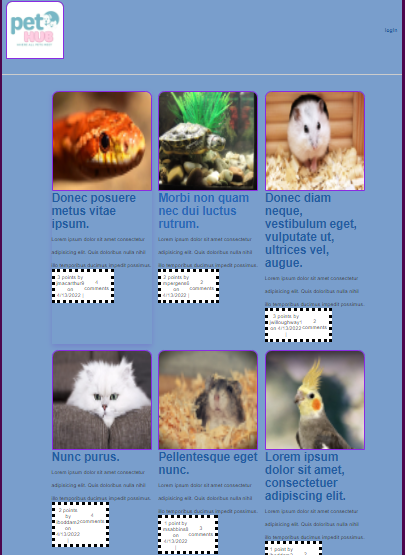

# PetHub   
  ## Description   
  A pet social media where users can create profiles for their pet, add blog posts with a picture, as well as vote and comment on other posts.   
  

 
 
 
 

  ## Deployed Links
  [GitHub Page](https://jclanc7507.github.io/PetHub/)

  [Heroku App](https://pethub-20161.herokuapp.com/)

  ## Repository Links
  [GitHub Repository](https://github.com/jclanc7507/PetHub)

  [Heroku Repository](https://dashboard.heroku.com/apps/pethub-20161)
  

  ## Table of Contents   
  * [Installation](#Installation)   
  * [Usage](#Usage)   
     
     
  * [Questions](#Questions)    
  * [License](#License)   

  ### Screenshot of Deployed Page:

  
  ## Installation
Run `npm i` to install Node.js packages. Next, input personal login credientals into the `.env` file, then open your MySQL and run `source db/schema.sql;` to create the database. Once the database has been created, execute `npm run seeds` to seed the web app.    

  ## Usage
Run `npm start` to execute the program.      
  
  ## Collaborators
  
  Jeremiah C. [GitHub](https://github.com/jclanc7507)

  Kathy M. [GitHub](https://github.com/CorgiPower11)

  Eric K. [GitHub](https://github.com/Erock42)
  
  Kim H. [GitHub](https://github.com/kimmy-hill)

     

  ## Questions   

  Please reach out to me on [GitHub](https://github.com/jclanc7507) or by email at jclanc7507@gmail.com for any additional questions.   

  ## License   
  MIT   
  
Copyright 2022 @jclanc7507 @CorgiPower11 @Erock42 @kimmy-hill
Permission is hereby granted, free of charge, to any person obtaining a copy of this software and associated documentation files (the "Software"), to deal in the Software without restriction, including without limitation the rights to use, copy, modify, merge, publish, distribute, sublicense, and/or sell copies of the Software, and to permit persons to whom the Software is furnished to do so, subject to the following conditions:

The above copyright notice and this permission notice shall be included in all copies or substantial portions of the Software.

THE SOFTWARE IS PROVIDED "AS IS", WITHOUT WARRANTY OF ANY KIND, EXPRESS OR IMPLIED, INCLUDING BUT NOT LIMITED TO THE WARRANTIES OF MERCHANTABILITY, FITNESS FOR A PARTICULAR PURPOSE AND NONINFRINGEMENT. IN NO EVENT SHALL THE AUTHORS OR COPYRIGHT HOLDERS BE LIABLE FOR ANY CLAIM, DAMAGES OR OTHER LIABILITY, WHETHER IN AN ACTION OF CONTRACT, TORT OR OTHERWISE, ARISING FROM, OUT OF OR IN CONNECTION WITH THE SOFTWARE OR THE USE OR OTHER DEALINGS IN THE SOFTWARE. 
